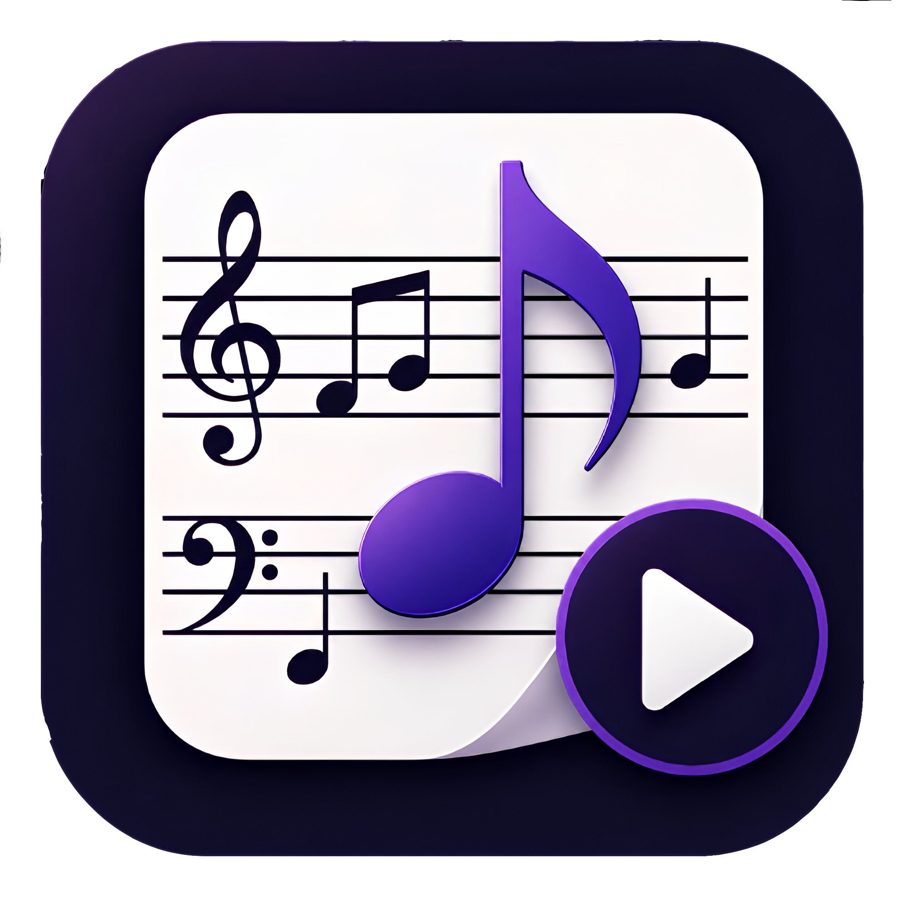
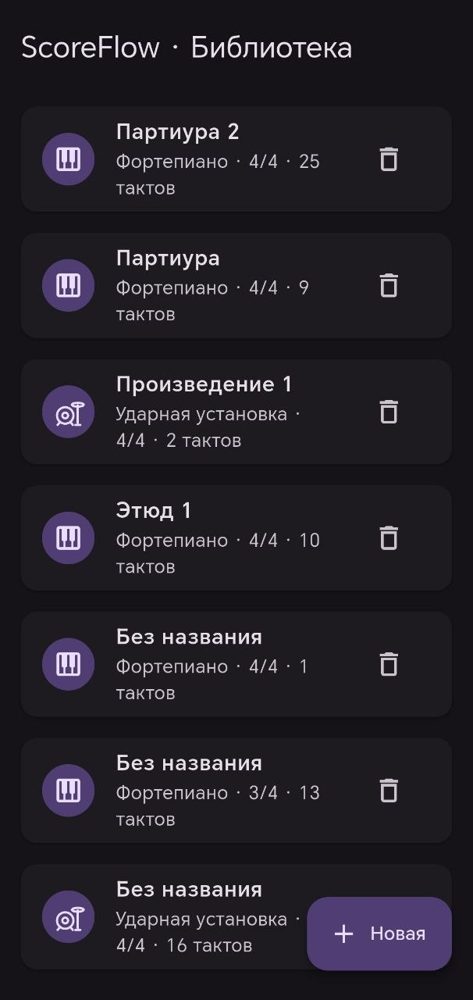
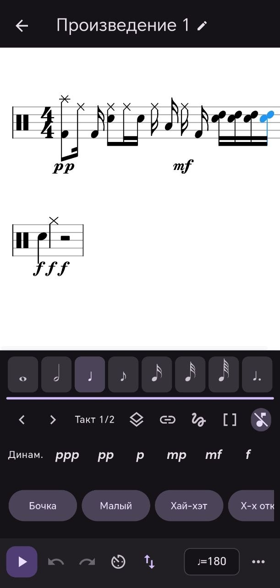
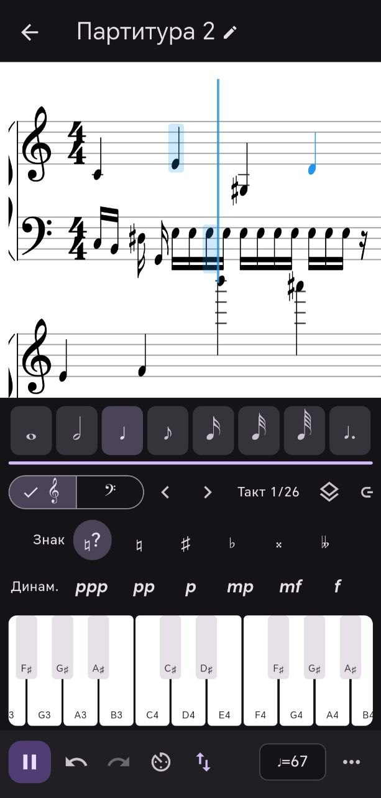
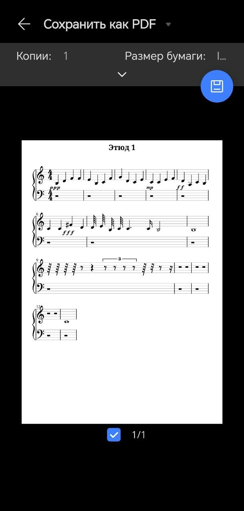

# ScoreFlow 🎼

<p align="center">
  
</p>

<p align="center">
  <strong>Открытый кроссплатформенный редактор нот, созданный на Flutter и VexFlow.</strong>
</p>

<p align="center">
  <a href="README.md">English</a> •
  <a href="ROADMAP.md">План развития</a> •
  <a href="LICENSE">Лицензия MIT</a>
</p>

<p align="center">
  <a href="LICENSE">
    
  </a>
  
  
  
  
  
</p>

---

> **ScoreFlow** — современный **офлайн-редактор нот**, ориентированный на **фортепианную** и **ударную** нотацию.
>
> Проект создан с использованием **Flutter**, **VexFlow** и **Web Audio API** и позволяет создавать, редактировать, воспроизводить и печатать нотные партитуры полностью локально — без аккаунта, облачного хранилища и подключения к Интернету.

В отличие от классических настольных редакторов нот, ScoreFlow разрабатывается по принципу **mobile-first**, сохраняя поддержку настольных платформ.

---

# ✨ Почему ScoreFlow?

* 🎼 Профессиональная нотная верстка на базе **VexFlow**
* 📱 Интерфейс, изначально разработанный для сенсорных устройств
* ⚡ Полностью автономная работа без сервера и облака
* 🎹 Реалистичное воспроизведение фортепиано
* 🥁 Полноценная поддержка ударной установки
* 📄 Экспорт качественных партитур формата A4
* 🌍 Кроссплатформенная архитектура
* 🟢 Открытый исходный код (MIT)

---

# 📸 Скриншоты

| Библиотека                   | Редактор                    |
| ---------------------------- | --------------------------- |
|  |  |

| Воспроизведение               | Предпросмотр PDF         |
| ----------------------------- | ------------------------ |
|  |  |

---

# 🚀 Возможности

| Возможность                       | Статус |
| --------------------------------- | :----: |
| Фортепианная нотация              |    ✅   |
| Нотация ударных                   |    ✅   |
| Большой нотный стан               |    ✅   |
| Аккорды                           |    ✅   |
| Несколько голосов                 |    ✅   |
| Триоли и произвольные группировки |    ✅   |
| Лиги и дуги                       |    ✅   |
| Альтерация                        |    ✅   |
| Динамические обозначения          |    ✅   |
| Тональности                       |    ✅   |
| Размеры                           |    ✅   |
| Профессиональная группировка нот  |    ✅   |
| Автоматическое заполнение пауз    |    ✅   |
| Undo / Redo                       |    ✅   |
| Умная вставка                     |    ✅   |
| Умное удаление                    |    ✅   |
| Выделение диапазона               |    ✅   |
| Выбор нот касанием                |    ✅   |
| Семплированное пианино            |    ✅   |
| Семплированные ударные            |    ✅   |
| Управление темпом                 |    ✅   |
| Метроном                          |    ✅   |
| Автопрокрутка при воспроизведении |    ✅   |
| Экспорт PDF                       |    ✅   |
| Локальное хранение                |    ✅   |
| Импорт MusicXML                   |   🚧   |
| Экспорт MIDI                      |   🚧   |
| Облачная синхронизация            |   📋   |

---

# 🏗 Архитектура

```text
                  Flutter

      UI • Состояние • Локальное хранение

                  │
                  ▼

      JSON Bridge (Base64)

                  │
                  ▼

    flutter_inappwebview

                  │

     InAppLocalhostServer

                  │

     ┌────────────────────────────┐
     │          VexFlow           │
     │                            │
     │      SVG-отрисовка         │
     │                            │
     │       Web Audio API        │
     │                            │
     │ Движок воспроизведения      │
     └────────────────────────────┘
```

---

# 🛠 Используемые технологии

| Компонент          | Технология           |
| ------------------ | -------------------- |
| Интерфейс          | Flutter              |
| Язык               | Dart                 |
| Отрисовка нот      | VexFlow              |
| Воспроизведение    | Web Audio API        |
| Связь Flutter ↔ JS | JavaScript Bridge    |
| Хранение данных    | Локальные JSON-файлы |
| Ресурсы            | InAppLocalhostServer |
| Архитектура        | Offline-first        |

---

# 💾 Полностью офлайн

ScoreFlow способен работать полностью без подключения к Интернету.

* Без регистрации
* Без облака
* Без сервера
* Без телеметрии
* Хранение партитур в JSON
* Встроенный движок VexFlow
* Встроенные аудиосемплы

Все ваши партитуры остаются только на вашем устройстве.

---

# 📄 Экспорт

Возможности экспорта:

* Верстка страниц A4
* Автоматическое выравнивание систем
* Высококачественная SVG-отрисовка
* Экспорт PDF через системное окно печати

---

# 🎹 Воспроизведение

Встроенный аудиодвижок поддерживает:

* Семплированный рояль Salamander Grand
* Семплированную ударную установку
* Планировщик Web Audio
* Подсветку активных нот
* Автоматическую прокрутку
* Управление темпом
* Метроном
* Поддержку педали Sustain

При отсутствии аудиосемплов автоматически используется программный синтезатор.

---

# 📁 Структура проекта

```text
lib/
assets/
docs/
test/
tools/

assets/www/
├── js/
├── piano/
└── drums/

lib/
├── models/
├── repository/
├── screens/
├── services/
└── widgets/
```

---

# 🚀 Быстрый старт

## Требования

* Flutter SDK
* Dart >= 3.12
* Android SDK 34+ (или Xcode для iOS)

## Клонирование

```bash
git clone https://github.com/IlyaSkorik/scoreflow.git
cd scoreflow
```

## Установка зависимостей

```bash
flutter pub get
```

## Запуск

```bash
flutter run
```

## Анализ кода

```bash
flutter analyze
```

## Тестирование

```bash
flutter test
```

---

# 🔊 Аудиосемплы

В проект уже включены семплы пианино и ударной установки.

При необходимости их можно пересоздать:

```bash
node tools/fetch_salamander.mjs
node tools/fetch_drums.mjs
```

Если семплы отсутствуют, движок автоматически переключается на программный синтезатор.

---

# 🗺 План развития

Ближайшие задачи:

* Crescendo / Diminuendo
* Импорт MusicXML
* Экспорт MIDI
* Копирование и вставка
* Множественное выделение
* Артикуляции
* Облачная синхронизация

Полный список задач находится в **ROADMAP.md**.

---

# 🤝 Участие в разработке

Мы будем рады вашему вкладу в развитие проекта.

1. Сделайте Fork репозитория.
2. Создайте новую ветку.
3. Внесите изменения.
4. Отправьте изменения в свой Fork.
5. Создайте Pull Request.

Перед отправкой убедитесь, что:

* код соответствует стилю проекта;
* `flutter analyze` выполняется без ошибок;
* все тесты успешно проходят.

---

# ⭐ Поддержка проекта

Если вам понравился ScoreFlow, поставьте репозиторию ⭐.

Это помогает другим разработчикам узнать о проекте и поддерживает его дальнейшее развитие.

---

# 📄 Лицензия

Проект распространяется по лицензии **MIT**.

Подробности можно найти в файле **LICENSE**.

---

<p align="center">
Создано с ❤️ сообществом ScoreFlow с использованием Flutter, VexFlow и Web Audio API.
</p>
